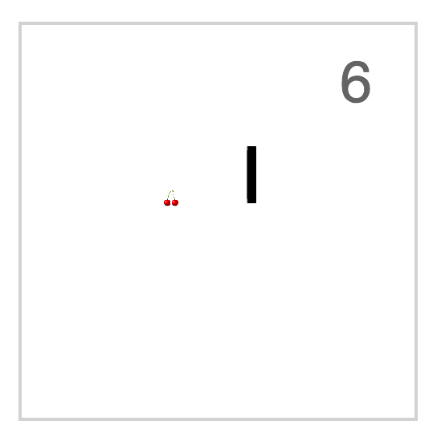
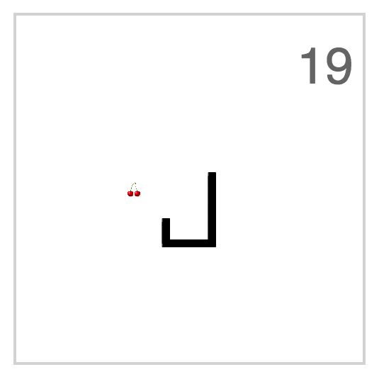

# Snake Game
A client side of the snake game controlled by the FaceOSC

## Summary
At the core of this game is a classic snake game - the goal is to collect as many fruits as possible. It is fully operational as a simple game, using arrows up/down/left/right. The game does not end upon hitting the walls or crossing itself. 

The additional FaceOSC control allows user to control the movement of the snake by the head position relative to the stratin position. For example, nodding up/down is equivalent to using up/down buttons. If the FaceOSC control is available it supresses the button behavior. 

*Note*: for this to function properly, you need to have FaceOSC open and running locally.

## Sample screenshots:

  
  

